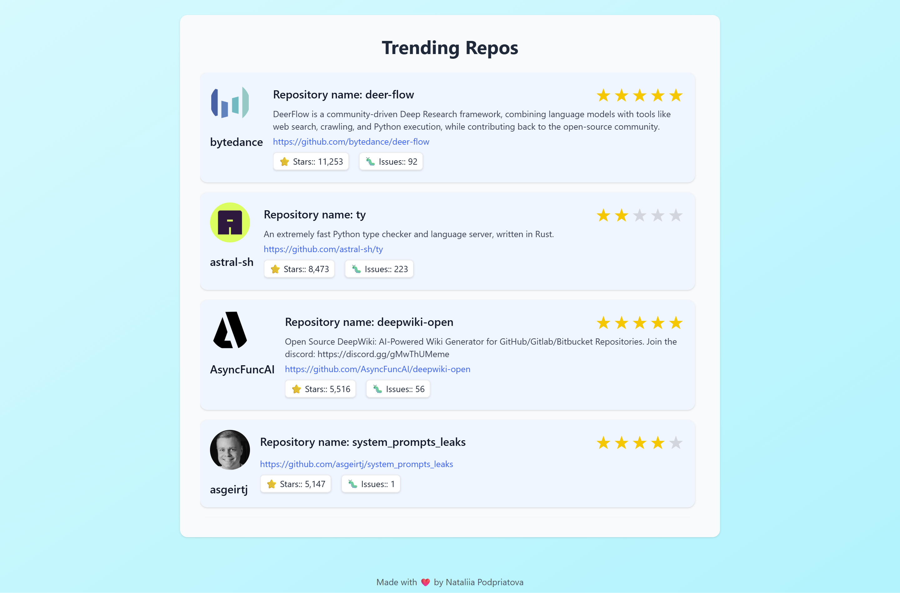

# Trending Repos Web App



## Table of Contents

- [Project Overview](#project-overview)
- [How to Run](#how-to-run)
  - [Development Server](#development-server)
  - [Production Build](#production-build)
- [Author](#author)

  👉 See [PROJECT.md](docs/PROJECT.md) for full implementation details.

## Project Overview

This is a lightweight Angular web application that lists the most starred GitHub repositories created in the last 30 days. The app fetches live data from the GitHub REST API and displays it in a user-friendly, paginated list format.

---

## How to Run

### Development Server

```bash
npx nx serve trending-repos
```

### Production Build

```bash
npx nx build trending-repos
```

---

## Author

Nataliia Podpriatova
