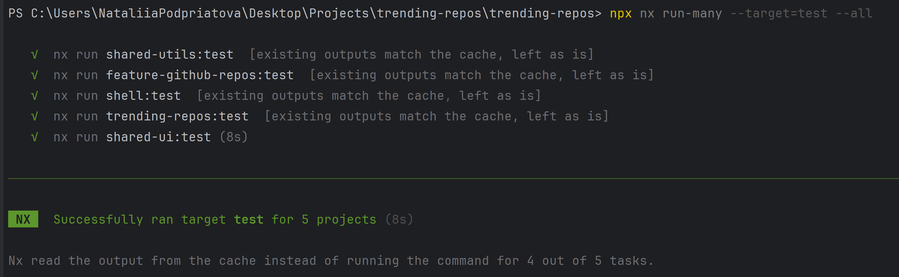
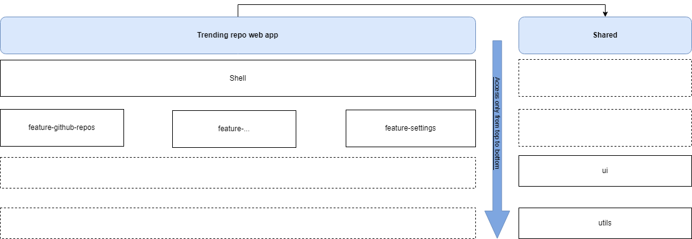

# Trending Repos Web App

## Table of Contents

- [Features](#features)
- [Technologies Used](#technologies-used)
- [Testing](#testing)
- [Code Quality and Structure](#code-quality-and-structure)

## Features

- **List Most Starred Repositories:** Displays repositories created within the last 30 days, sorted by stars.
- **Repository Details:** Each list item shows:
  - Repository name (clickable)
  - Description
  - Number of stars
  - Number of issues
  - Owner’s username and avatar
- **Infinite Scrolling:** Automatically loads more repositories as the user scrolls.
- **Modal with Details and Rating:**
  - Clicking a repo name opens a modal window with detailed info.
  - Users can rate the repository with a 5-star rating control.
  - Ratings are saved locally and displayed next to the repository name after closing the modal.

---

## Technologies Used

- **Angular:** Framework for building the frontend.
- **Nx Workspace:** For scalable monorepo management.
- **PrimeNG:** Used for UI components including modal dialogs.
- **RxJS:** For reactive data handling.
- **Local Storage:** To persist user ratings locally.
- **GitHub REST API:** Source for repository data.
- **Tailwind CSS:** For utility-first styling and responsive design.
- **Testing Library:** For robust and accessible Angular component testing.

---

## Testing

Run unit tests with:

```bash
npx nx run-many --target=test --all
```

Note:
Currently, only the shared-ui library is covered by unit tests. This is because most business logic and reusable components reside there. The app shell and feature modules have limited or no tests yet.

---



## Code Quality and Structure

The project is organized as an Nx monorepo with a clear modular structure to maintain scalability and reusability:

- **feature-lib**: Contains the core feature implementations, including components and services related to displaying and interacting with the trending GitHub repositories.
- **shell**: The main application shell responsible for bootstrapping the app, routing, and layout management.
- **shared-ui**: A standalone UI library containing reusable presentation components such as buttons, cards, dialogs, and other common UI elements styled with Tailwind CSS.
- **shared-utils**: Contains utility functions and services that can be shared across multiple parts of the app to promote DRY principles and consistency.

